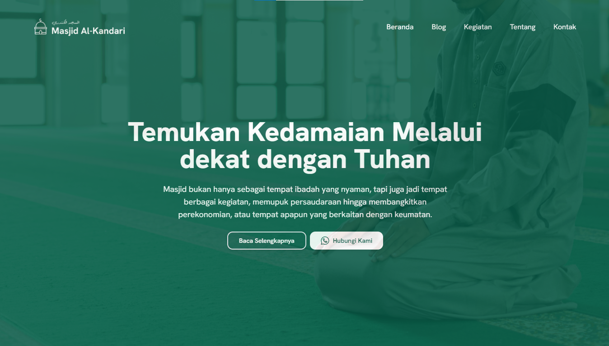

# Website Masjid Al-Kandari

Website ini dibuat menggunakan ReactJS dan TailwindCSS, serta Vite dan PNPM sebagai tools pembuatan website
Website ini berisikan penjelasan mengenai Masjid Al-kandari itu sendiri, baik kegiatan, lokasi, maupun fitur yang terdapat di masjid.

Jika memerlukan kode ini, anda hanya perlu menginstal PNPM dan menyediakan nodeJS pada perangkat.
